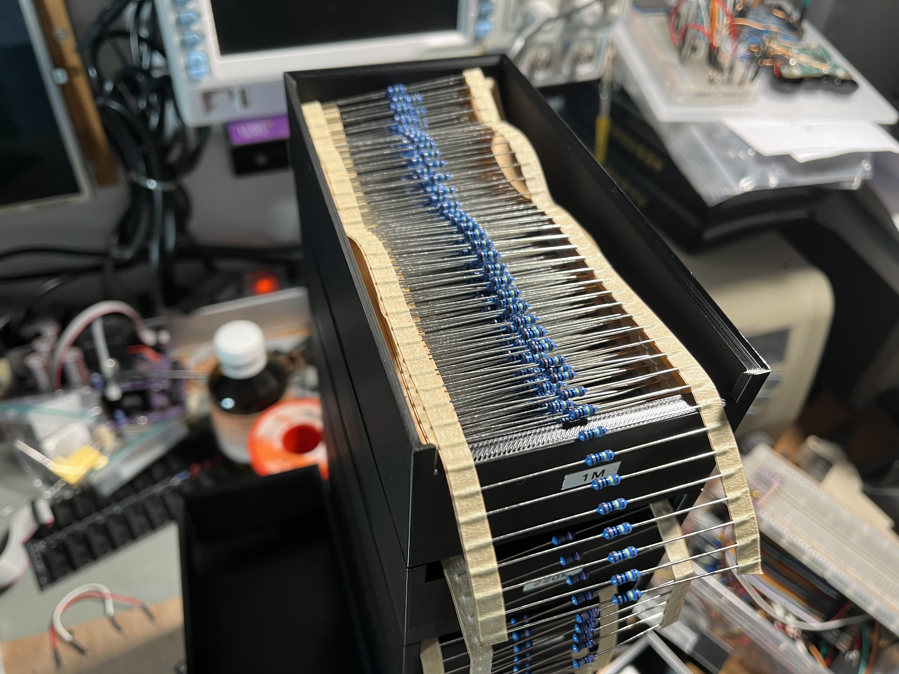

# Stackable Resistor Box

This repository contains a 3d model for a stackable box for through hole resistors. It can be printed without support and holds resistor belts with up to 1000 pcs.

## Print settings

* no support
* 15% infill
